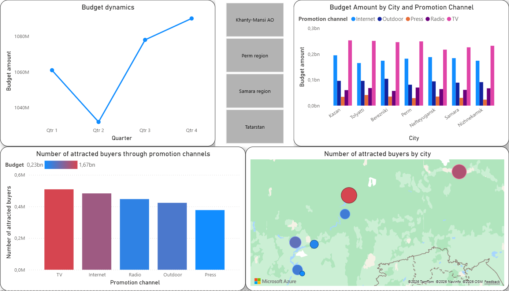

# Data Analytics Portfolio – Narmina

This repository contains several projects demonstrating practical skills in data analysis using Power BI, SQL, and Python.

The projects focus on data exploration, visualization, and analytical queries applied to marketing and sales datasets.

## Tools Used

- Power BI
- PostgreSQL
- Python (pandas, matplotlib, seaborn)

## Repository Structure

### 📊Power BI Dashboard

Marketing dashboard showing budget distribution and promotion channel effectiveness across cities.

Analysis of marketing budget distribution and promotion channel effectiveness across different cities.

Files included:
- dashboard_overview.png – screenshot of the main dashboard
- report.pdf – exported Power BI report

### 🗄SQL Analysis
Collection of SQL scripts demonstrating data extraction, joins, aggregations, subqueries and window functions in PostgreSQL.

Topics covered:
- data selection and filtering
- joins and aggregations
- subqueries
- window functions

### 🐍Python Analysis
Data cleaning and exploratory data analysis using Python.

The notebook demonstrates:
- data loading and preprocessing
- dataset merging
- exploratory analysis
- data visualization

## Skills Demonstrated

- Data visualization
- SQL querying and data manipulation
- Exploratory data analysis
- Data cleaning and preprocessing
- Marketing data analysis
